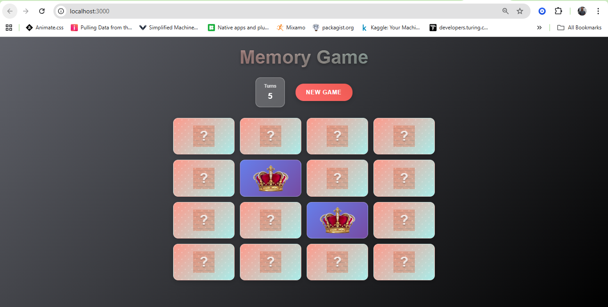
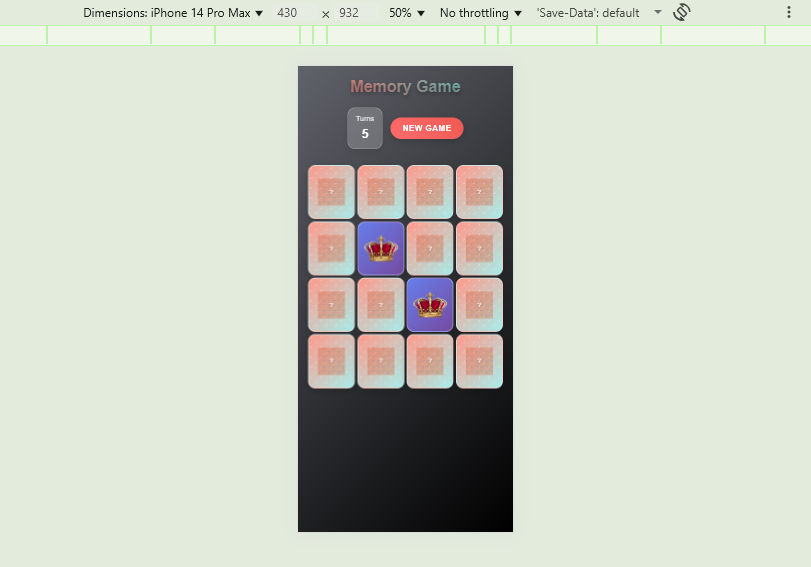

# 🧠 Memory Game App 

A modern, responsive memory card matching game application built with React.js featuring smooth animations, glassmorphism design, and mobile-first responsive layout.

## 📸 Screenshots





## ✨ Features

### 🎮 **Gameplay**
- **Classic Memory Matching** - Flip cards to find matching pairs
- **Turn Counter** - Track your progress and challenge yourself
- **Win Detection** - Celebration modal when you complete the game
- **Auto Shuffle** - Randomized card positions for each new game
- **Sound Effects** - Audio feedback for card flips

### 🎨 **Design & UX**
- **Modern UI** - Clean, contemporary design with gradient backgrounds
- **Glassmorphism Effects** - Frosted glass aesthetic with backdrop blur
- **Smooth Animations** - 3D card flip animations and hover effects
- **Visual Feedback** - Interactive elements with hover and click states
- **Celebration Modal** - Congratulatory popup when game is won

### 📱 **Responsive Design**
- **Mobile-First Approach** - Optimized for all screen sizes
- **Adaptive Grid** - Dynamic column layout based on screen width
- **Touch-Friendly** - Optimized for mobile and tablet interactions
- **Flexible Typography** - Fluid font sizes using clamp() functions
- **Cross-Platform Compatible** - Works on iOS, Android, and desktop browsers

###  **Accessibility**
- **Keyboard Navigation** - Full keyboard support
- **Focus Indicators** - Clear focus states for screen readers
- **High Contrast Support** - Enhanced visibility in high contrast mode
- **Reduced Motion Support** - Respects user's motion preferences
- **Screen Reader Friendly** - Proper ARIA labels and semantic HTML

## 🚀 Getting Started

### Prerequisites

- **Node.js** (version 14.0 or higher)
- **npm** or **yarn** package manager

### Installation

1. **Clone the repository**
   ```bash
   git clone https://github.com/EthanBukenya/memory-game-app.git
   cd memory-game
   ```

2. **Install dependencies**
   ```bash
   npm install
   # or
   yarn install
   ```

3. **Add your assets**
   - Place your card images (8 unique images) in `src/Assets/`
   - Add background card image as `back2.png`
   - Add sound effect as `a.mp3`

4. **Update card images**
   - Edit `src/imgexp.js` to import your card images
   ```javascript
   import card1 from './Assets/your-card1.png';
   // ... add all 8 card imports
   ```

5. **Start the development server**
   ```bash
   npm start
   # or
   yarn start
   ```

6. **Open your browser**
   - Navigate to `http://localhost:3000`

## 📁 Project Structure

```
src/
├── App.jsx                 # Main game component
├── App.css                 # Main application styles
├── index.js                # React entry point
├── index.css               # Global styles and resets
├── imgexp.js              # Card images export
├── Components/
│   ├── SingleCard.jsx     # Individual card component
│   ├── SingleCard.css     # Card styling and animations
│   ├── WinModal.jsx       # Victory celebration modal
│   └── WinModal.css       # Modal styling
└── Assets/
    ├── back2.png          # Card back design
    ├── a.mp3              # Sound effect
    ├── card1.png          # Game card 1
    ├── card2.png          # Game card 2
    └── ...                # Additional card images
```

## 🛠️ Built With

- **[React.js](https://reactjs.org/)** - Frontend framework
- **[CSS3](https://developer.mozilla.org/en-US/docs/Web/CSS)** - Styling and animations
- **[CSS Grid](https://developer.mozilla.org/en-US/docs/Web/CSS/CSS_Grid_Layout)** - Responsive layout system
- **[CSS Custom Properties](https://developer.mozilla.org/en-US/docs/Web/CSS/--*)** - Dynamic theming
- **Modern CSS Features** - `clamp()`, `backdrop-filter`, `aspect-ratio`

## 🎯 Game Rules

1. **Objective**: Match all pairs of identical cards
2. **Gameplay**: 
   - Click on any card to flip it over
   - Click on a second card to try to find a match
   - If cards match, they stay face up
   - If cards don't match, they flip back over
   - Remember card positions to make matches
3. **Winning**: Match all pairs to win the game
4. **Scoring**: Lower turn count means better performance

## 🎨 Customization

### **Changing Card Images**
1. Replace images in `src/Assets/` (recommended: 200x300px)
2. Update imports in `src/imgexp.js`
3. Ensure you have exactly 8 unique images

### **Modifying Colors**
Edit CSS custom properties in the respective `.css` files:
```css
/* Example: Change gradient colors in App.css */
.app {
  background: linear-gradient(135deg, #your-color1, #your-color2);
}
```

### **Adjusting Grid Layout**
Modify grid columns in `App.css`:
```css
.card-grid {
  grid-template-columns: repeat(auto-fit, minmax(120px, 1fr));
  /* Change minmax value for different card sizes */
}
```

### **Sound Effects**
- Replace `src/Assets/a.mp3` with your preferred sound
- Supported formats: MP3, WAV, OGG

## 📱 Browser Support

| Browser | Version |
|---------|---------|
| Chrome  | 88+ |
| Firefox | 78+ |
| Safari  | 14+ |
| Edge    | 88+ |

### **Required Features**
- CSS Grid Layout
- CSS Custom Properties
- ES6+ JavaScript features
- Audio API support

## 🐛 Troubleshooting

### **Common Issues**

**Cards not displaying:**
- Verify image paths in `imgexp.js`
- Check that all image files exist in `Assets/` folder
- Ensure image formats are supported (PNG, JPG, SVG)

**Sound not playing:**
- Check browser autoplay policies
- Verify audio file format compatibility
- Some browsers require user interaction before playing audio

**Layout issues on mobile:**
- Clear browser cache
- Check if viewport meta tag is present
- Verify CSS Grid support in target browsers

**Performance issues:**
- Optimize image file sizes (recommended < 100KB per image)
- Check for JavaScript errors in browser console
- Reduce animation complexity if needed

## 🤝 Contributing

1. **Fork the project**
2. **Create your feature branch** (`git checkout -b feature/AmazingFeature`)
3. **Commit your changes** (`git commit -m 'Add some AmazingFeature'`)
4. **Push to the branch** (`git push origin feature/AmazingFeature`)
5. **Open a Pull Request**

### **Development Guidelines**
- Follow existing code style and conventions
- Add comments for complex logic
- Test on multiple devices and browsers
- Ensure accessibility standards are maintained
- Update README.md for new features

## 📝 License

This project is licensed under the MIT License - see the [LICENSE](LICENSE) file for details.

## 🙏 Acknowledgments

- **React Community** - For the amazing framework and ecosystem
- **MDN Web Docs** - For comprehensive CSS and JavaScript documentation
- **CSS-Tricks** - For CSS Grid and Flexbox tutorials
- **Can I Use** - For browser compatibility information

## 📞 Support

If you have any questions, issues, or suggestions:

- **Create an issue** on GitHub
- **Email**: ethancylb@gmail.com
- **Documentation**: Check this README and code comments

## 🔄 Changelog

### **v1.0.0** (Current)
- Initial release
- Responsive design implementation
- Card matching game logic
- Win detection and celebration
- Sound effects integration
- Accessibility improvements

---

**⭐ Star this repository if you found it helpful!**

**🔗 [Live Demo](https://your-demo-url.com)** 
**📚 [Git Repository](https://github.com/EthanBukenya/memory-game-app)** 
**🐛 [Report Bug](https://github.com/EthanBukenya/memory-game-app/issues)**